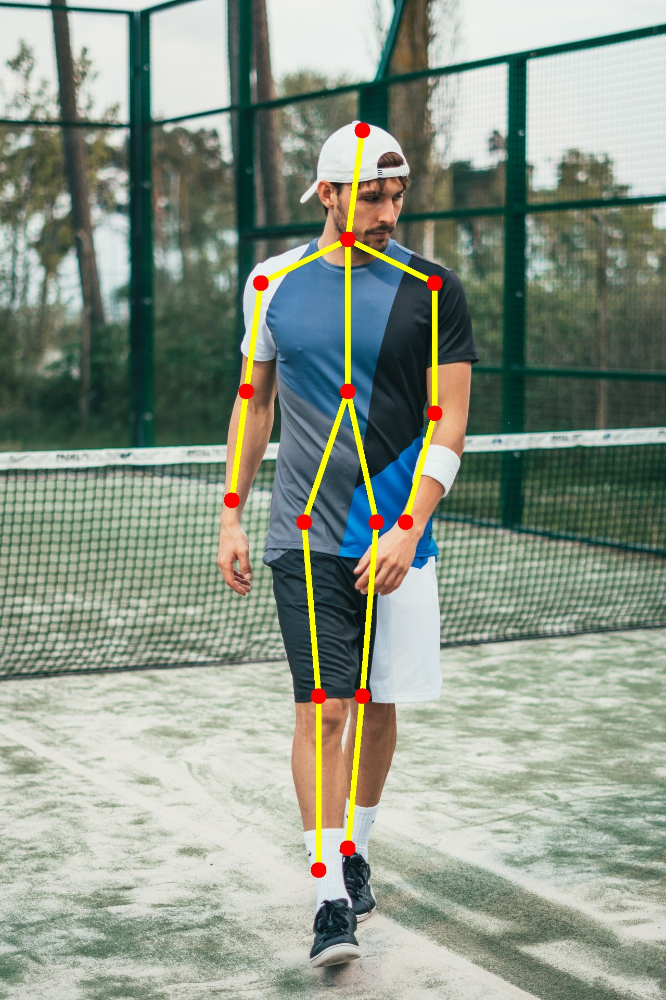
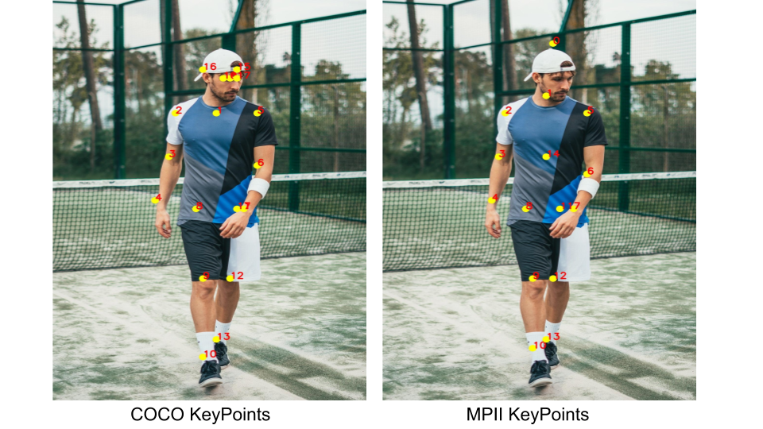

# OpenCV를 활용한 Human Pose Estimation 튜토리얼

본 글은 [Realtime Multi-Person 2D Pose Estimation using Part Affinity Field](https://arxiv.org/abs/1611.08050)논문, [Satya Mallick의 글](https://www.learnopencv.com/deep-learning-based-human-pose-estimation-using-opencv-cpp-python/) 및 [OpenResearch.ai의 글](http://openresearch.ai/t/stacked-hourglass-networks-for-human-pose-estimation/68)을
참고하여 작성했다.

본 튜토리얼은 OpenCV로 Human Pose Estimation을 수행하는 데에 있어 Deep Neural Network를 어떻게 사용하는지에 관한 것이다. 2016년에 COCO keypoints challenge에서 우승한 [Multi-Person Pose Estimation](https://arxiv.org/pdf/1611.08050.pdf) 모델을 활용했으며, 구현을 위해 OpenCV 3.4.1 이상의 버전을 필요로 한다. 

## 1. Introduction to Pose Estimation

```Pose Estimation```은 Computer Vision의 한 분야로, 사물의 position과 orientation을 detect하고자 하는 분야이다. 소위 ```Keypoint detection```라고 불리는데, 사물을 특징지을 수 있는 'keypoint' location을 detect하고자 하기 때문이다.

예를 들어, ```Face Pose Estimation```(a.k.a. ```Facial Landmark Detection```) 문제의 경우, 인간의 얼굴에 존재하는 특징점들을 detect하고자 한다. 이에 관한 자세한 사항은 [Facemark : Facial Landmark Detection using OpenCV](https://www.learnopencv.com/facemark-facial-landmark-detection-using-opencv/) 및 [Facial Landmark Detection using Dlib](https://www.learnopencv.com/facial-landmark-detection/)글을 참고하길 바란다.

```Head Pose Estimation```이라는 분야도 있다. 얼굴의 특징점을 활용해서, (카메라의 위치를 중심으로) 두상의 상대적인 3D orientation을 알아내고자 하는 것이다. 

본 글에서는 신체의 메이저 부위 및 관절 포인트들을 detect하고 localize하는 ```Human Pose Estimation```분야에 초점을 맞추고자 한다.

Tony Stark가 아이언맨 슈트를 입는 장면을 떠올려보자. 만약 아이언맨 슈트가 상용화된다면, ```Human Pose Estimation``` 분야의 연구가 반드시 필요할 것이다!


<p style="text-align: center;">Figure 1 : Sample Skeleton output of pose estimation</p>

Pose detector의 일반적인 output은 위와 같이 나타난다. 이제 본격적으로 데이터셋, 아키텍쳐 및 코드를 분석해보자.

## 2. Architecture

본 튜토리얼에서는 CMU Perceptual Computing Lab에서 제안한 [Multi-Person Pose Estimation](https://arxiv.org/pdf/1611.08050.pdf) 모델을 활용하고자 한다. 


<p style="text-align: center;">Figure 2: Multi-Person Pose Estimation model architecture</p>

## 2.1. Multi-Person Pose Estimation Model Overview

본 모델의 input과 output은 다음과 같다. 
```
- input  
color image
(size - h x w x 3) (h: height, w: weight, 3: RGB channel)

- output  
2D location of keypoints for each person in the image
```
즉, 사람이 포함된 이미지를 넣으면 사람마다 2D keypoint를 detect하는 것이다. 

Detection 과정은 세 단계로 이뤄진다.

#### Stage 1) Input image로부터 Feature map 생성
VGGNet의 첫 10개 레이어를 활용하여, input 이미지의 feature map을 생성한다.

#### Stage 2) Part Confidence Maps, Part Affinity Fields 출력
본 multi-stage CNN은 두 개의 branch로 구성되어 있다. 첫번째 branch는 Part Confidence Maps를 출력하고, 두번째 branch는 Part Affinity Fields를 출력해낸다.


<p style="text-align: center;">Figure 3 : Showing confidence maps for Left Shoulder for the given image</p>

첫번째 branch는 특정 신체 부위 keypoint에 대한 2D confidence maps를 출력한다. 쉽게 말해서 무릎이나 팔꿈치와 같은 관절이 있을 것으로 예상되는 위치를 히트맵으로 나타낸 것이다. 위 그림(Figure 3)은 왼쪽 어깨 keypoint에 대한 confidence map을 나타낸다.


<p style="text-align: center;">Figure 4 : Showing Part Affinity maps for Neck – Left Shoulder pair for the given image</p>

두번째 branch는 특정 관절로부터 다른 관절로 이어지는 것을 2D 벡터맵으로 나타낸다. 이를 Affinity Fields라고 부르는 이유는, 특정 관절들의 'affinity'를 벡터맵으로 나타내기 때문이다. 이를테면, 사람의 목 - 어깨 - 팔꿈치 는 서로 연결되어있기 때문에, 이를 잘 인식했을 경우 1에 가까운 숫자들이 벡터맵에 채워질 것이다. 반면, 서로 다른 사람의 어깨와 팔꿈치의 경우 0에 가까운 숫자들이 채워질 것이다. 위 그림(Figure 4)은 목과 왼쪽 어깨의 affinity를 나타내고 있다. 

출력된 Part Confidence Maps와 Part Affinity Fields 및 Feature들을 다음 네트워크 모듈에 넘기고, 그 네트워크에서 출력된 결과들을 다시 다음 네트워크에 넘기는 방식으로 마지막 네트워크까지 진행한다. 이러한 과정을 거침으로써, 특정 관절 keypoints가 국소적인 부분만을 학습하는 것이 아닌, 전체 관절 간의 관계 및 사람의 전체 형상을 함께 고려하여 학습할 수 있다. 이 부분은 [Stacked Hourglass Network for Human Pose Estimation](https://arxiv.org/abs/1603.06937)과 구조가 유사하다.

#### Stage 3) Parsing을 통해 사람마다 2D keypoints 추출
Stage 2에서 얻어진 관절 keypoints는 말 그대로 전체 이미지 상 관절의 위치일 뿐, 아직 사람 별로 묶여지지는 않은 상태이다. Part Affinity Fields를 활용하여 특정 사람의 관절들을 연결시킬 수 있다. 

## 2.2. Datasets

```Pose Estimation```을 위해 활용할 수 있는 주요 데이터셋은 아래와 같은 것들이 있다. 
* COCO Keypoints challenge
* MPII Human Pose Dataset
* VGG Pose Dataset


<p style="text-align: center;">Figure 5 : COCO Keypoints and MPII Keypoints</p>

[Realtime Multi-Person 2D Pose Estimation using Part Affinity Field](https://arxiv.org/abs/1611.08050)논문에서는 COCO와 MPII의 두 가지 데이터셋을 활용한다. COCO 데이터셋으로 학습한 모델의 경우 18개의 keypoints를, MPII 데이터셋으로 학습한 모델의 경우 15개의 keypoints를 출력한다. 위 사진은 각 모델에서의 출력된 결과물을 나타낸다. 자세한 output 포맷은 아래와 같다.

```
COCO Output Format
Nose – 0, Neck – 1, Right Shoulder – 2, Right Elbow – 3, Right Wrist – 4,
Left Shoulder – 5, Left Elbow – 6, Left Wrist – 7, Right Hip – 8,
Right Knee – 9, Right Ankle – 10, Left Hip – 11, Left Knee – 12,
LAnkle – 13, Right Eye – 14, Left Eye – 15, Right Ear – 16,
Left Ear – 17, Background – 18
```
```
MPII Output Format
Head – 0, Neck – 1, Right Shoulder – 2, Right Elbow – 3, Right Wrist – 4,
Left Shoulder – 5, Left Elbow – 6, Left Wrist – 7, Right Hip – 8,
Right Knee – 9, Right Ankle – 10, Left Hip – 11, Left Knee – 12,
Left Ankle – 13, Chest – 14, Background – 15
```
모델의 학습된 weight들은 [이곳](https://github.com/CMU-Perceptual-Computing-Lab/openpose/tree/master/models)에서 다운받을 수 있다. 

## 3. Code for Human Pose Estimation in OpenCV

일단은 Single Person Pose Estimation부터 시작하자. Multi Person Pose Estimation 구현에 관해서는 차후 작성하도록 하겠다.

## 3.1. Step 1 : Download Model Weights

다음을 순차적으로 실행한다.
```
git clone https://github.com/spmallick/learnopencv.git
cd learnopencv/OpenPose
sudo chmod a+x getModels.sh
./getModels.sh
```
다운로드 과정을 성공적으로 실행했다면, 현재 디렉토리 (learnopencv/OpenPose) 내에 pose, face, hand 디렉토리가 생성되어 있을 것이고, 그 안에 아래 파일들을 확인할 수 있을 것이다.
```
pose/coco/pose_iter_440000.caffemodel
pose/mpi/pose_iter_160000.caffemodel
face/pose_iter_116000.caffemodel
hand/pose_iter_102000.caffemodel
```

참고로 위 모델들은 size가 매우 크기 때문에, github 상에 push되지 않는다. 이 점 참고하고 로컬에서 돌려보시길.

## 3.2 Step 2: Load Network

아래 코드를 실행하면  .prototxt 파일과 .caffemodel 파일을 볼 수 있다.
```
cd pose/coo
ls
```
.prototxt 파일은 뉴럴 네트워크의 아키텍처를 정의하고, .caffemodel 파일은 trained model의 weights들을 저장한다. 

이제 Jupyter Notebook에서 본 repository 상의 Korean_Tutorial_OpenPose.ipynb 파일을 열자.
해당 파일의 영문 원본은 learnopencv/OpenPose/OpenPose_Notebook.ipynb이다.

Step 2, Step 3, Step 4의 자세한 설명은 Korean_Tutorial_OpenPose.ipynb에서 볼 수 있다.
본 README.md에서는 코드의 큰 흐름만을 짚고 넘어갈 것이다.

## 3.3. Step 3: Read Image and Prepare Input to the Network

## 3.4. Step 4: Make Predictions and Parse Keypoints

## 3.5. Step 5: Draw Skeleton

정리하자면, 현재 디렉토리 내에 아래와 같은 파일 및 디렉토리들이 존재해야 한다.
```
CMakeLists.txt
face
getModels.sh
hand
img
Korean_Tutorial_OpenPose.ipynb
learnopencv
multiple.jpeg
OpenPoseImage.cpp
OpenPoseImage.py
OpenPoseVideo.cpp
OpenPoseVideo.py
pose
README
sample_video.mp4
single.jpeg
```
face, hand, pose 디렉토리 내에 caffemodel들이 있어야 하고,
현재 디렉토리에서 Korean_Tutorial_OpenPose.ipynb를 열고 실행시키면 된다. 
